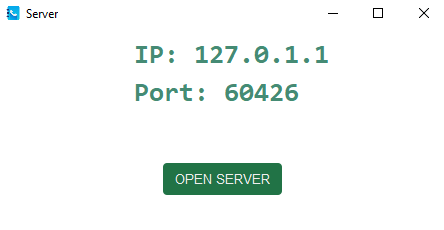
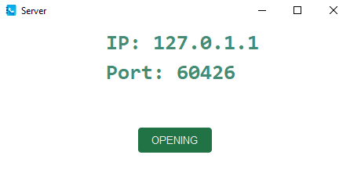
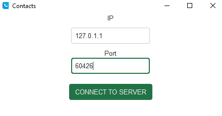
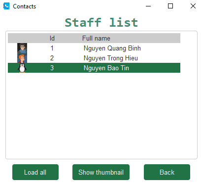
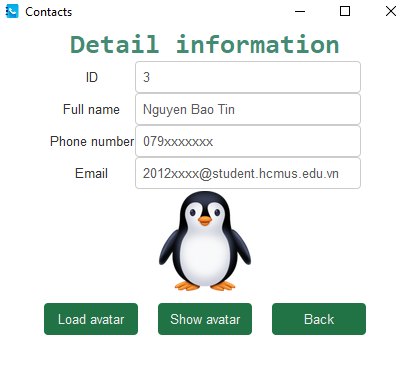

# Contact app


**Content:**
<ul style="list-style-type: none">
    <li><a href="#about">About us</a></li>
    <li><a href="#installation">Installation</a></li>
    <li><a href="#demo">Demo</a></li>
</ul>

<h5 id="about"></h5>

## 1. About us
We will introduce briefly about our project:

+ This is our mid-term project for the Computer Networking course at HCMUS.
+ This application allows clients and server to connect to each other using TCP/IP communication. The contact list is stored on the server. On the other hand, clients have the ability to view the information of other clients by requesting to the server.


### Contributors:

|   Student ID   |            Name               | Profile 
|----------------|-------------------------------|----------------------------
|    20120412    |Nguyen Quang Binh | [@nqbinh47](https://github.com/nqbinh47)            
|    20120476    |Nguyen Trong Hieu | [@NguyenHiu](https://github.com/NguyenHiu)           
|    20120596    |Nguyen Bao Tin | [@nbtin](https://github.com/nbtin)


<h5 id="installation"></h5>

## 2. Installation

```shell
git clone https://github.com/nqbinh47/Contact-App
cd Contact-App
pip install -r requirements.txt
```
You can execute the app by running the `makefile` command:
+ **Database**: `make database`
+ **Server**: `make server`
+ **Client**: `make client`

<h5 id="demo"></h5>

## 3. Demo
This app was written in `Python` language and enhanced the UI with `Tkinter` library.

### 3.1. Server
Server             |  Opened server
:-------------------------:|:-------------------------:
  |  

### 3.2. Client








## Final Notes

**Thanks for going through this Repository! Have a nice day.**

Got any queries? Feel free to contact us via <a href = "mailto: baotin2402@gmail.com">E-mail</a>.


